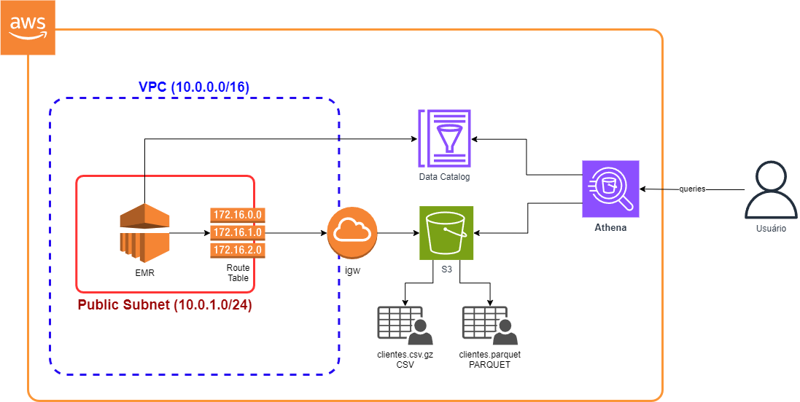
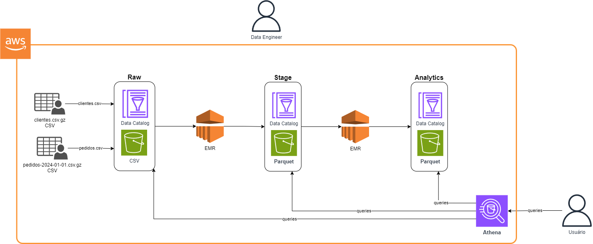

# Curso de Terraform para Engenheiros de Dados
Author: Prof. Barbosa  
Contact: infobarbosa@gmail.com  
Github: [infobarbosa](https://github.com/infobarbosa)

## Ambiente de laboratório
Este curso foi desenvolvido para execução principalmente em ambiente **Linux**. 
Caso você não tenha um à disposição então recomendo utilizar o AWS Cloud9. 
As instruções de criação estão [aqui](99-Cloud9-Environment).

## O que vamos construir

## O fluxo

## Módulos

1. [Introdução ao Terraform](01-introducao-terraform)
2. [Variáveis](02-variaveis)
3. [Módulos](03-modulos)
4. [VPC](04-vpc)
5. [EC2](05-ec2)
6. [Glue Catalog](06-glue-catalog)
7. [EMR](07-emr)
8. [Lambda](08-lambda)
9. [Integração e deploy contínuo](09-integracao-e-deploy-continuo)
